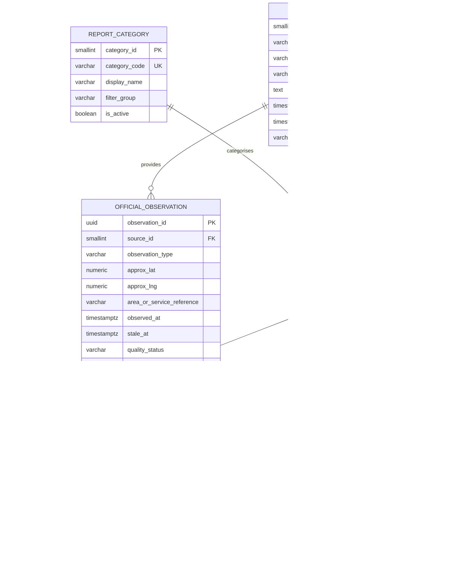

# Datasets and Pre-processing Scripts

---

## ERD

```mermaid
erDiagram
    DATA_SOURCE ||--o{ COMMUNITY_REPORT : labels
    DATA_SOURCE ||--o{ OFFICIAL_OBSERVATION : provides
    REPORT_CATEGORY ||--o{ COMMUNITY_REPORT : categorises
    COMMUNITY_REPORT ||--o{ REPORT_REVIEW : reviewed_by
    COMMUNITY_REPORT ||--o{ REPORT_OBSERVATION_MATCH : checked_against
    OFFICIAL_OBSERVATION ||--o{ REPORT_OBSERVATION_MATCH : supports
    COMMUNITY_REPORT o|--o{ COMMUNITY_REPORT : duplicate_of

    DATA_SOURCE {
        smallint source_id PK
        varchar source_code UK
        varchar source_kind
        varchar display_name
        text source_url
        timestamptz last_checked_at
        timestamptz last_success_at
        varchar availability_status
    }

    REPORT_CATEGORY {
        smallint category_id PK
        varchar category_code UK
        varchar display_name
        varchar filter_group
        boolean is_active
    }

    COMMUNITY_REPORT {
        uuid report_id PK
        smallint category_id FK
        smallint source_id FK
        numeric approx_lat
        numeric approx_lng
        varchar approximate_location_label
        varchar optional_comment
        uuid submission_key UK
        varchar report_status
        timestamptz created_at
        timestamptz expires_at
        uuid duplicate_of_report_id FK
    }

    OFFICIAL_OBSERVATION {
        uuid observation_id PK
        smallint source_id FK
        varchar observation_type
        numeric approx_lat
        numeric approx_lng
        varchar area_or_service_reference
        timestamptz observed_at
        timestamptz stale_at
        varchar quality_status
        jsonb source_payload
    }

    REPORT_OBSERVATION_MATCH {
        uuid report_id PK, FK
        uuid observation_id PK, FK
        varchar validation_result
        numeric match_score
        timestamptz matched_at
    }

    REPORT_REVIEW {
        uuid review_id PK
        uuid report_id FK
        varchar review_action
        varchar review_reason
        varchar actor_type
        timestamptz reviewed_at
    }
```
