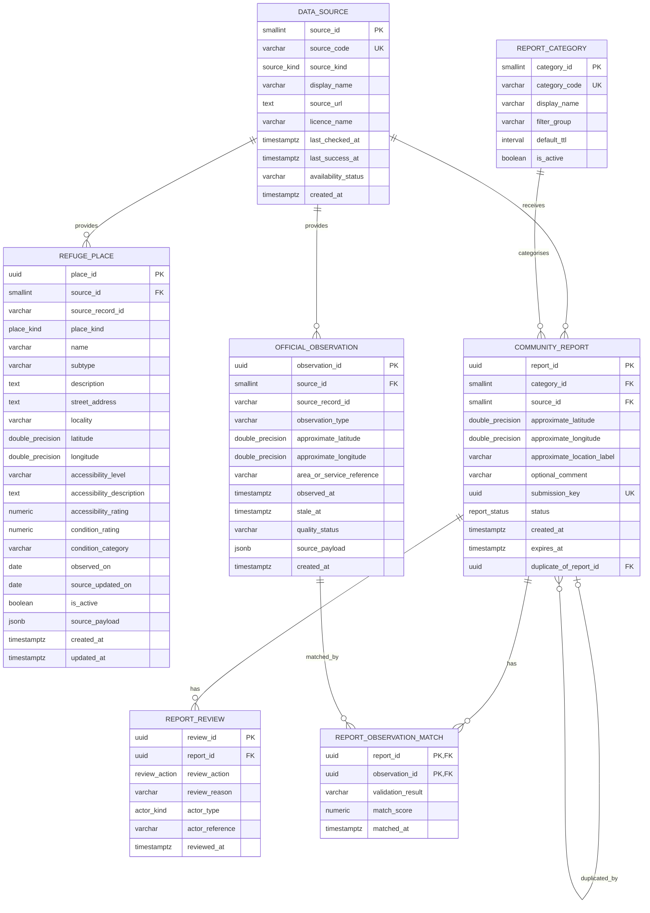

# Datasets and Pre-processing Scripts

---

## ERD

The diagram below reflects the implemented PostgreSQL 17 schema in
`data/database/init/001_schema.sql`. The SQLite development fallback only
implements the community-report and review subset.

The physical schema also enforces the composite unique constraints
`REFUGE_PLACE(source_id, source_record_id)` and
`OFFICIAL_OBSERVATION(source_id, source_record_id)`. The latter uses
`NULLS NOT DISTINCT`. `REPORT_OBSERVATION_MATCH(report_id, observation_id)` is
the composite primary key. Coordinates, ratings, match scores, expiry times and
self-duplicate references are protected by `CHECK` constraints in the schema.
